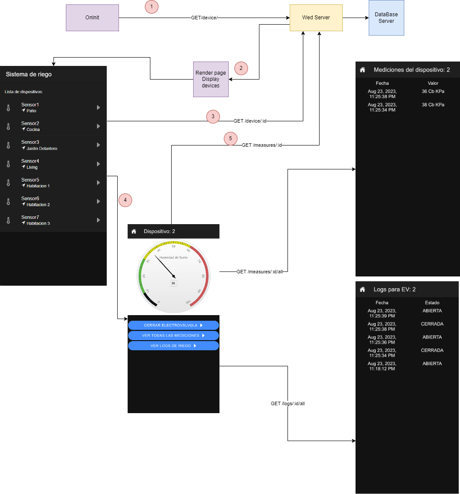
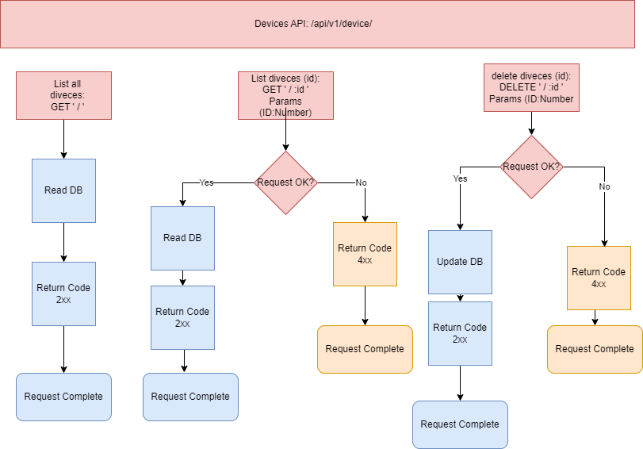
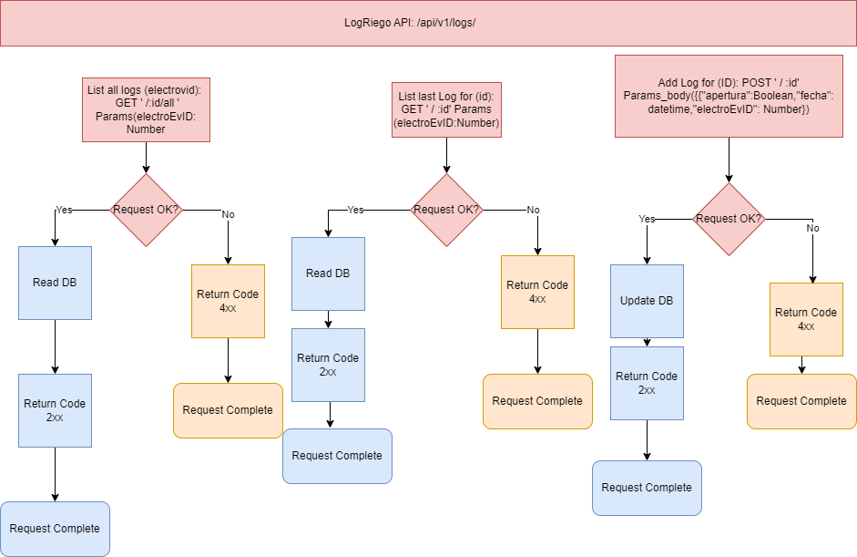

# CEIoT - Desarrollo de Aplicaciones Multiplataformas

## Trabajo final - Sistema de Riego basado en Ionic 

Configuracion y uso:

1) Clonar el repositorio
    Abrir una terminal y ejecutar 'git clone git@github.com:JhonatanJuno/TPFINAL_DAM.git'
2) Front-End:
   1) Ejecutar el comando 'ionic repair' en la carpeta ./src/frontend/ (si tenemos error 
   en ionic instalar con el comando 'npm install -g @ionic/cli').
   2) Una vez regeneradas las carpetas de componentes de Angular, ejecutar 'ionic serve'.
3) Back-End:
   1) En una nueva terminal, ubicarnos en el directorio principal de la clonacion:
      1) Correr docker-compose up
      2) si la base de datos no inicializara correctamente, ejecutar el script TPFinal.sql de la carpeta DB/Dumps/TPFinal.sql, esto se debe a que la aplicacion fallara si no hay lecturas de dispositivos

## Arquitectura de la aplicacion:

La aplicacion consta de un backend, desarrallado en NodeJS, y de un frontend, desarrollado en Ionic.
En la siguiente figura se pueden ver las interacciones de la aplicacion de frontend con el backend:

Estructura de APIs del backend:

### Device API:

### LogRiego API:

### Measures API:
